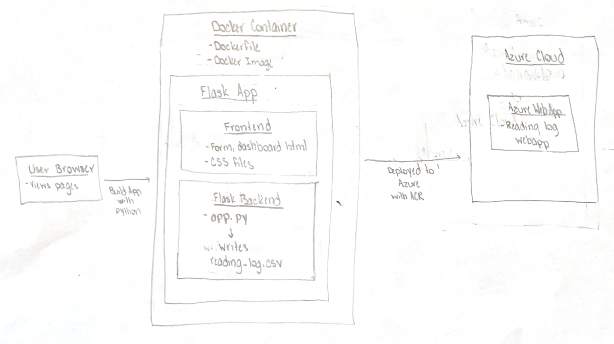
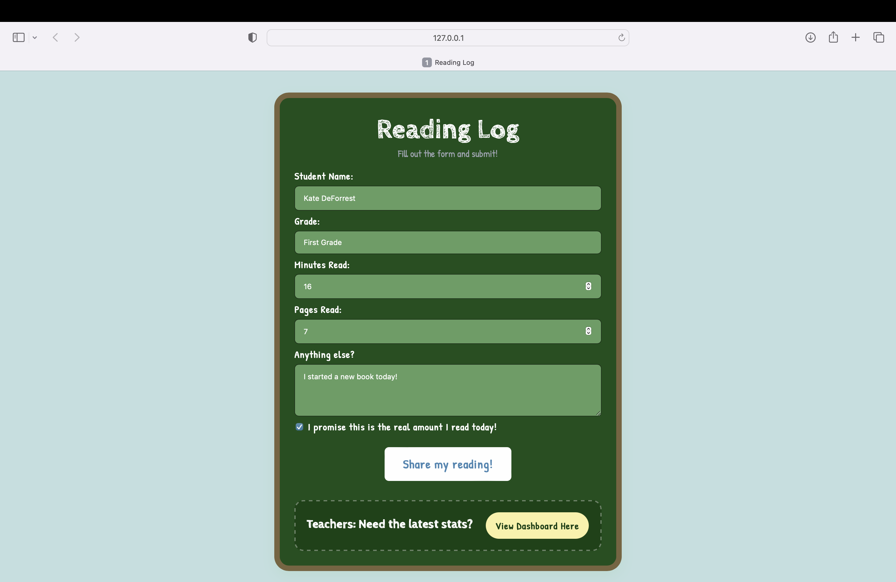
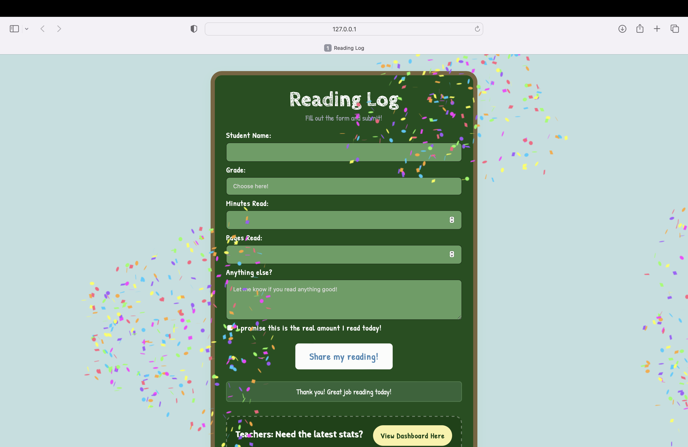
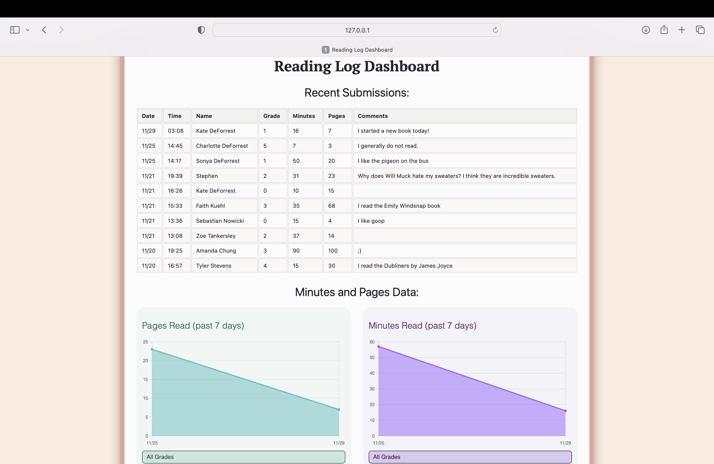
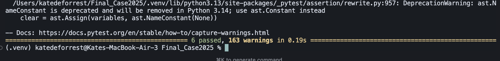

# Final Case Study- Reading Log Form and Dashboard

## **Executive summary**

***Problem***

Over the past years, especially after the COVID-19 pandemic, US teachers have observed a decrease in their students’ reading, in addition to lower reading test scores. While it is possible for schools to rely on national trends like these to shift curricula to account for trends like decreased reading, individual school districts lack information about how their own students compare. It is difficult for teachers and administration to collect consistent, comprehensive data on their students’ reading habits; many don’t have the time or resources to ask students daily about their reading and keep the information in an easy-to-access digital location. Furthermore, teachers, especially those in K5 classrooms, could greatly benefit from platforms that allow them to collect and monitor their student’s reading and other habits. 

***Solution***

This app contains both a form for students to fill out with their daily reading and a dashboard for teachers to see overall data trends in their student’s reading. It was designed to be used by a school to monitor reading among individual grades; so, students fill out their grade and teachers can then look at averages and weekly trends within each. The form is simple for students to use, and collects their name, grade, minutes, and pages read. The dashboard reports the information with the most recent submissions, graphs reporting pages read over the week, grade reading averages, and leaderboards with the most pages and minutes read. A link also allows the csv file to be downloaded to an educator’s computer. While teachers often rely on standard paper for students to log their reading habits, with a digital platform, students can rely on the familiarity of the same form in a convenient location. Data is then kept in one location for teachers and doesn’t require any analysis. Furthermore, this app will make it easier for students and teachers to report and monitor data. 


## **System Overview**

***Course concept:*** Flask API

The system uses a Flask app to collect, store, and visualize data. The frontend, contained in the frontend/ folder contains both the files of index.html (to submit the form) and dashboard.html (to view the data) and uses no external frameworks. It communicates with the backend with JSON POST. The backend runs using Flask API and accepts submissions from /v1/reading_log, validates incoming data, adds entries to the CSV file, computes the data for the dashboard with /v1/dashboard_data, and allows the CSV file to be downloaded with /download_csv. 

***Architecture Diagram:***



***Data/Models/Services:***

*Sources:* reading_log.csv, index.html, dashboard.html, app.py

*Sizes:* reading_log.cvs is initially 0 KB and grows with more reading log submissions, while index.html and dashboard.html are a few KBs. 

*Formats:* Formats include HTML, CSS, and JS in the frontend, and JSON and CSV for the API responses and CSV data file. 

***License & Credits***

*Data:* Data is kept in a CSV file (reading_log.csv). The file has the fields date, time, name, grade, minutes, pages, comments, and truth. It is generated by the user when they fill out the HTML form from the API, and will grow over time with more submissions. The file reading_log.csv already has 20 entries in it. 

*Services:*

Flask Web Application: connects the HTML frontend, JSON submissions, writes the CSV, and computes the data for the dashboard. 

Environment Variable Loader: allows for loading environment variables to store configuration values, including CSV_FILE, HOST, and PORT. 

Docker: Docker is used as a container for the application for deployment. 

Azure Public Cloud: The app is hosted on Microsoft Azure. This allows for users to have public access, scalability, and cloud availability. 

*License:* This project is licensed under the MIT License. See the LICENSE file for more details.

*Credits:*
- Built with [Python](https://www.python.org/) and [Flask](https://flask.palletsprojects.com/).
- Uses standard Python libraries (listed in `requirements.txt`).
- All survey questions and data were created by the author.

*Note:* No external datasets or models were used in this project.


## **How to Run (local)**


The project uses Docker and runs with a run.sh script. The commands below can be used to start the app. 

``` chmod +x run.sh # make the app executable```

```docker build -t final-case:latest .```

```docker run -v $(pwd)/data:/app/data -p 5000:5000 final-case:latest```


## **Design Decisions​​**

*Why this concept?*

It was vital to create the simplest possible form for both children and parents to use on a daily basis. One form was also needed for all students, so it was easier for teachers to distribute them and monitor the results. Therefore, instead of creating multiple forms for each grade or class, only one form was created with only the needed questions, including name, grade, pages, minutes read, other comments, and a promise reporting truth. It was also necessary for teachers to easily access the dashboard from the form, where the data was laid out in a simple way and could be easily downloaded to use. This was an easier system than creating a separate link and location for them to view the data. The form and the dashboard were also separated from each other to keep the form student-friendly with a simple layout and interactive elements such as confetti, and the teacher dashboard to include more complex information. 

*Tradeoffs:*

The app is simple and works well with collecting submissions and posting them to the CSV file. This serves its intended purpose of simplifying data collection for teachers and students. However, this simplicity creates a tradeoff that comprehensive data cannot be collected, as it is being reported by the students themselves who may not always be reliable, and less categories in the survey could be included. Additionally, there is no monitoring on the CSV file, so it would be easy to be altered by any false submissions, or if submissions that are empty or incomplete. Furthermore, the largest tradeoff in this project is that its simplicity for users contributes to less data and analysis. 

By hosting on the cloud, there is a higher cost to running this app and information in the CSV file could be accessed and exposed. Using Docker also makes the setup of the app locally easier. Furthermore, test_api.py allows for the app to be maintained. 

 *Security:*

Sensitive values are stored in the .env file (for example, SECRET_KEY) and python-dotenv. The API also ensures that the JSON files that are submitted are the correct type and rejects those that are not. If an incorrect data type is submitted, it is left blank in the reading_log.csv. PII is not collected, except for the name that is submitted in the form. However, it is only kept locally in the CSV file. When using the Cloud app, reading_log.csv does not have a persistent file, so data is not stored and cannot be accessed by anyone, only the one currently using the app. 

*Ops:*

The app uses Flask to report errors and for basic request handling, and no analytics or advanced metrics are used. Docker also captures container logs. Furthermore, it is designed to be used on a small scale with a smaller CSV file and the Flask server is single-threaded. Docker allows for it to be deployed with containerization, which could allow for scaling, along with programs like Gunicorn. Some of the limitations of the project are that the CSV file is local, so it cannot be shared easily among different classrooms or schools. There are also no checks on authentication when submitting the form, so anyone with access to the server can submit data to the reading log and dashboard. Additionally, another limitation is that on the cloud, the CSV data is ephemeral, meaning it is only stored in the container. So, every time the container restarts, the data is lost, while when it is run locally it is kept in the project folder and can be reused. 

## **Results and Evaluation**

Below are screenshots of the form being filled out, the successful submission message, and the dashboard after the form is filled out. 





*Performance Notes:* The app worked successfully. The form collected data that would be submitted by students, and it was accurately reflected in the dashboard. Even though it would be easy to report false data, if all data was reported correctly and honestly the app would work well. The app has a small resource footprint as it runs locally with minimal memory and CPU, stores information in a CSV file, and can be containerized easily with docker without high resource requirements. 

*Tests Performed:*

In app.py, the app route endpoint /test verifies that the API is running and returns the message “Flask CSV API is running”. 

In test_api.py, a temporary CSV file is created. In it, the following tests are run-

test_requires_json checks input validation for JSON payloads 

test_happy_path checks that JSON files are submitted and that they are added to the CSV file correctly

test_dashboard_data_returns_valid_json makes sure that the dashboard API returns all of the information for the dashboard in a JSON file

test_root_smoke is a smoke test to make sure that the server is running

test_form_route makes sure that the form route is working

test_download_csv makes sure the CSV download is working

If all tests are passed, pytest will report that all 6 tests are passed (see image below). 



## **What’s Next**

Some improvements to the current app that can be done are to ensure authentication for those who are submitting the form and add error messages if a form is submitted incorrectly rather than just leaving those fields blank in the CSV file. To make the code easier to read, app.py could be separated into routes.py and services.py for readability. Finally, some more stretch features that could be added are more features added to the dashboard, such as sorting the data by students or class, and more data on overall reading statistics like weekly averages and days with the most reading. Additionally, charts or images could be exported from the dashboard. Finally, the form and dashboard could be altered to be school-specific with dropdowns for certain classes or teachers. On the cloud, by mounting a persistent volume or using a cloud database, data could be stored for longer and be used on a larger scale. 

## **Links**

GitHub Repo- https://github.com/ksdeforrest/Final_Case2025

Public Cloud App (Azure)- https://readinglog-webapp.azurewebsites.net/
